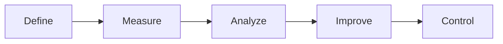

# Project Plan: Web Scraper & Referral Exchange Platform (DMAIC Strategy)

This document serves as the single source of truth for the requirements, architectural specifications, database schemas, and development strategy for the **Job Scraper & Referral Exchange Tool**.

---

## 📐 Development Methodology: DMAIC (Six Sigma)

We will follow the Lean Six Sigma **DMAIC** framework (Define, Measure, Analyze, Improve, Control) to align with continuous improvement principles and ensure a robust, zero-cost operational flow.

---

## 1. DEFINE (D) — Project Scope & Core Goals

### A. The Core Goals
1. **Demand-Driven Job Scraping**: Run targeted web scraping based specifically on jobs and companies requested by active Seekers, rather than scraping "in the dark".
2. **Personal Job Hunting (Admin)**: Feed your own target search criteria (AI, Ops, Automation) as an admin preference to keep your personal job hunt automated.
3. **Referral Sourcing Marketplace**: Match external candidates (Seekers) with company employees (Givers) willing to refer them for those scraped matched roles.
4. **Automated Monetization**: Collect vetting fees via Payment Gateway API integrations (Stripe, Razorpay, or Cashfree) to ensure real-time transaction verification, paying Givers automatically upon successful referral confirmations.
5. **Prospect Directory & Outreach**: Systematically discover potential referrers at target companies (Prospects) requested by Seekers, invite them via email/social automation, and track outreach status.
6. **Sure Shot Hiring**: Establish a direct pathway for Hiring Managers to list open roles, define their own placement fees, and guarantee a role (or an immediate direct interview loop) to eligible candidates, bypassing general job scraping.

### B. Core Personas
1. **Seekers (Job Hunters)**:
   - Input their job hunting parameters (Desired Role/Keywords, Target Companies, LinkedIn profile, and upload Resume link).
   - View scraped matched roles and unlock direct referrer contact details upon payment verification.
   - Apply for guaranteed "Sure Shot" roles by submitting credentials and paying the manager's custom fee.
2. **Givers (Referrers)**:
   - Register their company, role, and contact email.
   - Earn rewards/payouts when they successfully refer seekers for matched listings.
3. **Hiring Managers (Direct Employers)**:
   - Create profile cards verified by corporate domains.
   - Post active target job openings directly.
   - Set custom application fees and guarantee candidate placement/loops if predefined eligibility matches.
4. **Admin (Damak)**:
   - Manages seeker preferences and uses them to dictate web scraping targets.
   - Triggers targeted outreaches to potential referrers (Prospects) at companies requested by seekers.
   - Administers the payment escrow pool to coordinate refunds or release payouts.

---

## 2. MEASURE (M) — Operational Metrics

To keep the platform highly efficient, we will track the following KPIs:
- **Scraper Anomaly Rate**: % of failed crawl runs or rate-limited pages.
- **Inventory Freshness**: Average age of job listings in the active directory (goal: < 48 hours).
- **Match Conversion Rate**: % of Seeker applications that successfully connect with a Giver.
- **Outbound Conversion**: % of searched prospects who agree to join the Referral Exchange.
- **Daily Quota Margin**: Safe buffer space under Google Apps Script's daily quotas (e.g., email limits, execution time).

---

## 3. ANALYZE (A) — Technology Stack Selection

To keep the project **100% free of charge** and easily maintainable, we will use the following integrated stack:

| Component | Technology | Cost | Purpose |
| :--- | :--- | :--- | :--- |
| **Hosting & Frontend** | Vercel (Hobby Tier) | $0.00 | Hosts the portfolio UI (`index.html`, etc.) built with Tailwind CSS & Alpine.js. |
| **Database** | Google Sheets | $0.00 | Acts as our relational data warehouse. Easy to view, edit, and bulk import data. |
| **Backend & API** | Google Apps Script (GAS) | $0.00 | Runs serverless REST endpoints (`doGet`, `doPost`) to serve database queries, parse webhooks, and process forms. |
| **Payment Gateway** | Razorpay / Cashfree / Stripe | $0.00 (Pay-per-transaction) | Processes seeker checkout payments and triggers backend webhooks on success. |
| **Local Dev / Sync** | `clasp` (CLI) | $0.00 | Allows coding the Apps Script backend locally in Git, deploying directly from VS Code. |
| **Scheduler (Crons)** | GAS Time-Driven Triggers | $0.00 | Triggers the daily/hourly job scraping and active-state checks. |

---

## 4. IMPROVE (I) — Database Schema & Setup

The data model will be stored across multiple sheets in a single Google Spreadsheet:

### Sheet 1: `Seeker_Preferences` (Crawl Config & Demand)
Stores target criteria submitted by active job seekers.
- `seeker_id` (Unique ID)
- `seeker_name` (Name)
- `desired_roles` (Comma-separated keywords, e.g., "React Developer, Frontend Engineer")
- `desired_companies` (Comma-separated target firms, e.g., "Salesforce, JPMorgan")
- `resume_url` (Link to resume)
- `linkedin_url` (Profile Link)
- `status` (Active / Fulfilled / Paused)

### Sheet 2: `Job_Inventory` (Matched Scraper Outputs)
Stores active open listings matching active seeker preferences.
- `job_id` (Unique string hash)
- `seeker_id` (Reference to `Seeker_Preferences` who requested this match)
- `company` (e.g., Salesforce)
- `title` (e.g., Software Engineer - React)
- `link` (URL to apply)
- `date_scraped` (Timestamp)
- `status` (Active / Inactive)

### Sheet 3: `Giver_Directory` (Active Referrers)
Stores professionals willing to provide referrals.
- `id` (Unique integer)
- `name` (Name of referrer)
- `company` (Target company they work at)
- `linkedin_url` (Verified profile)
- `contact_email` (For direct coordination)
- `status` (Vetted / Pending)

### Sheet 4: `Seeker_Requests` (Applications / Matches)
Logs seekers asking for referrals to matched jobs.
- `request_id` (Unique integer)
- `seeker_id` (Reference to `Seeker_Preferences`)
- `job_id` (Reference to `Job_Inventory`)
- `giver_id` (Reference to `Giver_Directory` matched)
- `transaction_id` (Payment transaction ID returned by Gateway)
- `payment_status` (Pending / Verified)
- `match_status` (Pending / Connected / Archived)

### Sheet 5: `Outreach_Prospects` (Prospect Givers)
Directory of target employees mapped to companies requested by seekers.
- `prospect_id` (Unique integer)
- `seeker_id` (Seeker who triggered this prospect search)
- `name` (Target referrer name)
- `company` (Company they work at)
- `linkedin_url` (Profile Link)
- `outreach_status` (Not Contacted / Invited / Joined)

### Sheet 6: `Hiring_Managers` (HM Profiles)
Profiles of employers directly posting roles with hiring authority.
- `manager_id` (Unique ID)
- `name` (Hiring Manager Name)
- `company` (Employer Company)
- `linkedin_url` (Verified profile)
- `corporate_email` (For domain verification, e.g. name@company.com)
- `status` (Pending / Verified / Blocked)

### Sheet 7: `Direct_Postings` (Premium Jobs Directory)
Non-scraped, hot job roles directly listed by hiring managers.
- `job_id` (Unique ID)
- `manager_id` (Reference to `Hiring_Managers`)
- `title` (Job Title)
- `description` (Job Details & Team Scope)
- `eligibility_criteria` (Required skills, experience, or certifications)
- `custom_fee` (Application fee set by manager in USD/coins)
- `guarantee_terms` (Details of the guaranteed role path)
- `date_posted` (Timestamp)
- `status` (Active / Filled / Suspended)

### Sheet 8: `Sure_Shot_Applications` (Guaranteed Placements)
Tracks applications and payment escrow for Sure Shot jobs.
- `application_id` (Unique ID)
- `seeker_id` (Reference to `Seeker_Preferences`)
- `job_id` (Reference to `Direct_Postings`)
- `portfolio_url` (Credentials submitted for verification)
- `payment_id` (Transaction token from Stripe/Razorpay)
- `amount_paid` (Amount charged)
- `escrow_status` (Held / Released to Manager / Refunded to Seeker)
- `placement_status` (Applied / Interviewing / Hired / Ineligible)

---

## 5. CONTROL (C) — Process Control & Quality Assurance

To prevent the scraper from breaking, ensure clean data, and maintain platform trust:
- **Scraper Aggregator Feeds**: To bypass IP blocks on custom career sites, the scraper pulls job postings from free developer aggregator APIs (like **Adzuna API** or public feeds of **Indeed/Naukri**).
- **Asynchronous Processing**: The front-end form acts as a subscription registry. Scraping and matching run as background crons, preventing server timeouts and notifying users via email updates.
- **Double-Confirmation Trust Loop**: Since referrals are completed inside corporate firewalls, verification is confirmed by the Givers (as they have a financial incentive to confirm they referred the Seeker to claim their payout). The Giver uploads their referral confirmation number, which you verify on sheet dashboard to release payments.
- **Payment API Webhooks**: Payments are integrated via Stripe/Razorpay webhooks. When a Seeker pays the vetting fee, the gateway calls your Google Apps Script endpoint which automatically verifies the transaction and unlocks the match.
- **Outreach Automation**: Automated email invites are drafted in Google Apps Script and triggered safely via your Gmail quota, inviting target prospects to sign up as referrers without risking LinkedIn account restrictions.
- **Broken Link Checker**: A daily script runs in Google Apps Script, sends `UrlFetchApp` requests to active links, and flags any URLs returning a `404` or `302 redirect` as `Inactive`.
- **Duplicate Prevention**: The scraper hashes the company + job title to create a unique ID, skipping duplicate listings.
- **Sure Shot Escrow Safety Loop**: When a seeker applies for a Direct Posting, their fee is held in escrow (`Sure_Shot_Applications` Sheet). The funds are only released to the Hiring Manager upon successful hiring verification or progression to the final loop. If the seeker is vetted as ineligible (based on the public pre-defined checklist) or the HM fails to deliver the guaranteed role evaluation, the payment is automatically refunded back to the Seeker, protecting both sides.
- **Corporate Domain Verification**: Hiring Managers must verify their account via a link sent to their corporate email (matching the company domain), ensuring that only authorized managers post direct guarantee opportunities.

